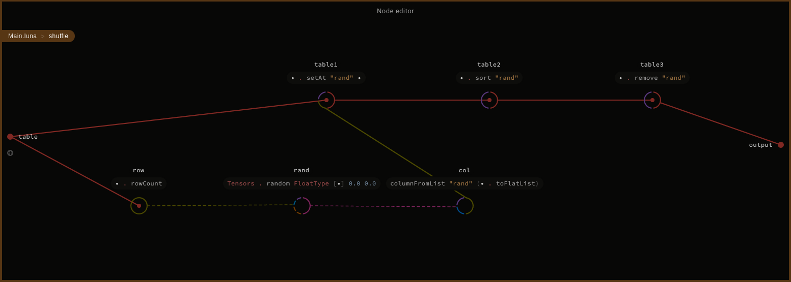
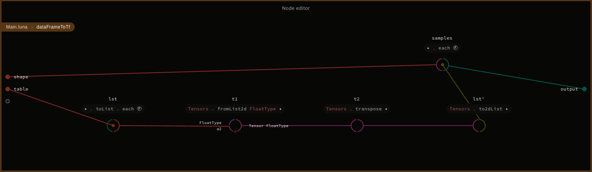
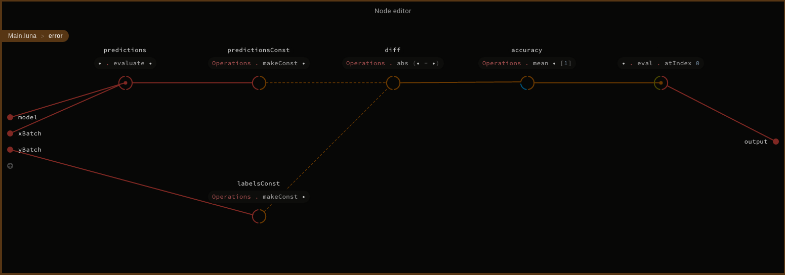
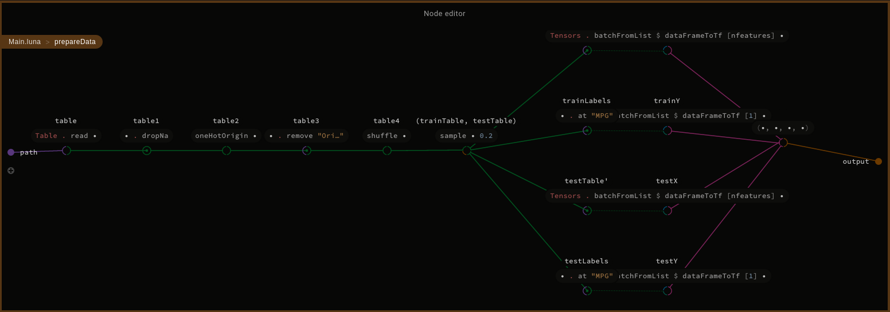
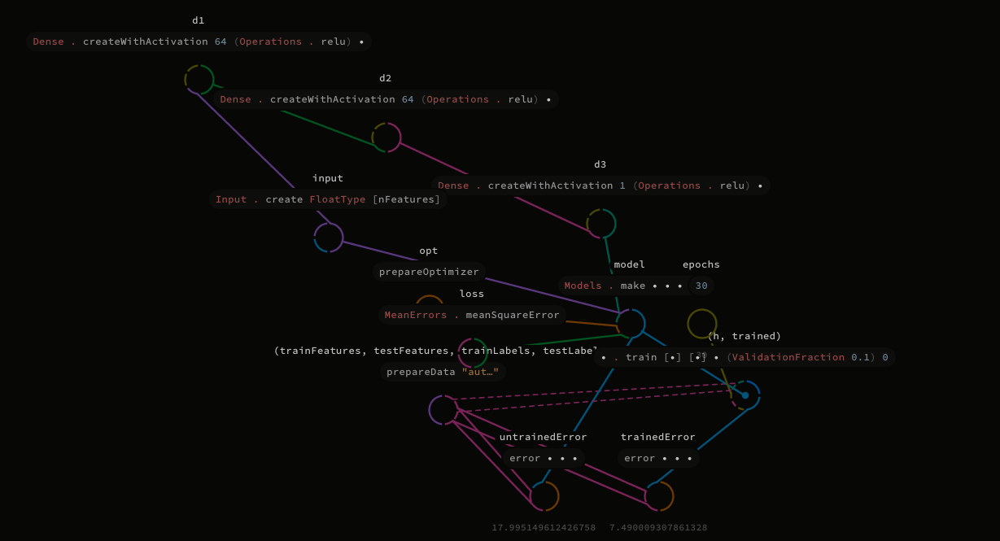
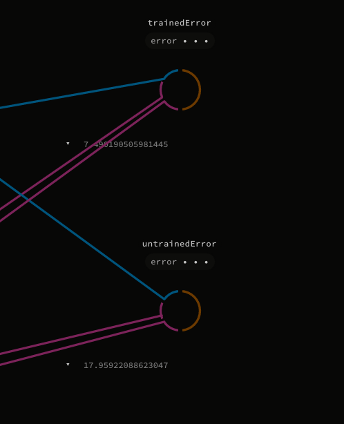

 <center>

# Luna Regression Tutorial

</center>

Based on https://www.tensorflow.org/tutorials/keras/basic_regression

Dataset was downloaded from https://archive.ics.uci.edu/ml/machine-learning-databases/auto-mpg/auto-mpg.data and it has been slightly modified to be loaded out of the box.

## Cloning repository.

```bash
git clone https://github.com/Luna-Tensorflow/RegressionTutorial.git
git clone -b MNIST_tutorial https://github.com/Luna-Tensorflow/Luna-Tensorflow.git
cd RegressionTutorial
```

## Building libraries.
```bash
cd local_libs/Tensorflow/native_libs/
mkdir build
cd build
cmake ../src
make
cd ../../../..
```

## Let's start with Luna Studio!

```
import Std.Base
import Dataframes.Table
import Dataframes.Column
import Tensorflow.Layers.Input
import Tensorflow.Layers.Dense
import Tensorflow.Optimizers.RMSProp
import Tensorflow.Losses.MeanError
import Tensorflow.Model
import Tensorflow.Tensor
import Tensorflow.Types
import Tensorflow.Operations
import Tensorflow.GeneratedOps
import RegressionTutorial.DblColumn
```

```
def extendWith table name value:
    table' = table.eachTo name (row: (row.at "Origin" == value).switch 0.0 1.0)
    table'
```

```
def oneHotOrigin table:
    t1 = extendWith table "USA" 1
    t2 = extendWith t1 "Europe" 2
    t3 = extendWith t2 "Japan" 3
    t3
```

```
def shuffle table:
    row = table.rowCount
    rand = Tensors.random FloatType [row] 0.0 0.0
    col = columnFromList "rand" (rand.toFlatList)
    table1 = table.setAt "rand" col
    table2 = table1.sort "rand"
    table3 = table2.remove "rand"
    table3
```



```
def sample table fracTest:
    testCount = (fracTest * table.rowCount.toReal).floor
    test = table.take testCount
    train = table.drop testCount
    (train, test)
```

```
def nfeatures:
    9
```

```
def dataFrameToTf shape table:
    lst = table.toList . each (col: (col.toList).each (_.toReal))
    t1 = Tensors.fromList2d FloatType lst
    t2 = Tensors.transpose t1
    lst' = Tensors.to2dList t2
    samples = lst'.each(l: Tensors.fromList FloatType shape l)
    samples
```



```
def error model xBatch yBatch:
    predictions = model.evaluate xBatch
    predictionsConst = Operations.makeConst predictions
    labelsConst = Operations.makeConst yBatch
    diff = Operations.abs (predictionsConst - labelsConst)
    accuracy = Operations.mean diff [1]
    accuracy.eval.atIndex 0
```



```
def prepareData path:
    table = Table.read path
    table1 = table.dropNa
    table2 = oneHotOrigin table1
    table3 = table2.remove "Origin"
    table4 = shuffle table3
    (trainTable, testTable) = sample table4 0.2

    trainLabels = trainTable.at "MPG"
    testLabels = testTable.at "MPG"
    trainTable' = trainTable.remove "MPG"
    testTable' = testTable.remove "MPG"

    trainX = Tensors.batchFromList $ dataFrameToTf [nfeatures] trainTable'
    testX = Tensors.batchFromList $ dataFrameToTf [nfeatures] testTable'
    trainY = Tensors.batchFromList $ dataFrameToTf [1] trainLabels
    testY = Tensors.batchFromList $ dataFrameToTf [1] testLabels

    (trainX, testX, trainY, testY)
```



```
def prepareOptimizer:
    lr = 0.001
    rho = 0.9
    momentum = 0.0
    epsilon = 0.000000001
    opt = RMSPropOptimizer.create lr rho momentum epsilon
    opt
```

```
def main:
    (trainX, testX, trainY, testY) = prepareData "auto-mpg3.csv"
    
    input = Input.create FloatType [nfeatures]
    d1 = Dense.createWithActivation 64 Operations.relu input
    d2 = Dense.createWithActivation 64 Operations.relu d1
    d3 = Dense.createWithActivation 1 Operations.relu d2

    opt = prepareOptimizer

    loss = MeanErrors.meanSquareError

    model = Models.make input d3 opt loss
    
    untrainedError = error model testX testY

    epochs = 30
    (h, trained) = model.train [trainX] [trainY] epochs (ValidationFraction 0.1) 0
    trainedError = error trained testX testY

    None
```



