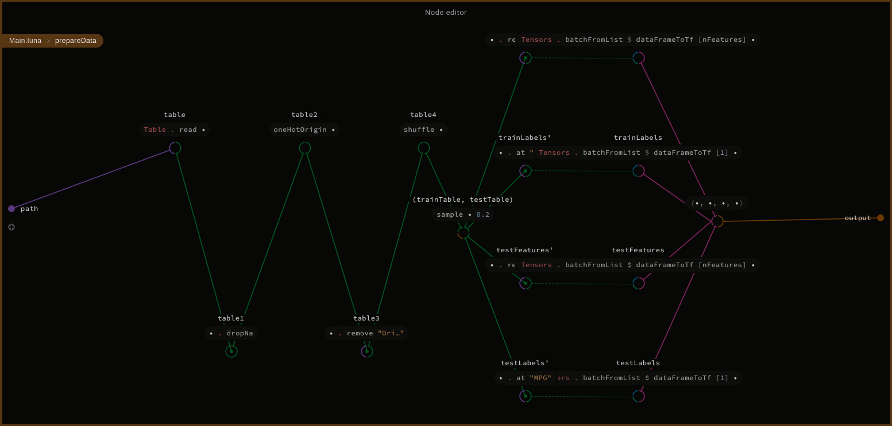
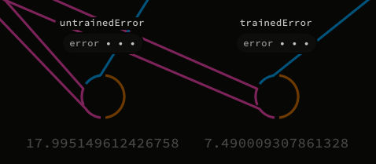

 <center>

# Luna Regression Tutorial

</center>

Based on https://www.tensorflow.org/tutorials/keras/basic_regression

Dataset was downloaded from https://archive.ics.uci.edu/ml/machine-learning-databases/auto-mpg/auto-mpg.data and it has been slightly modified to be loaded out of the box.

## Cloning repository.

```bash
git clone https://github.com/Luna-Tensorflow/RegressionTutorial.git
git clone -b MNIST_tutorial https://github.com/Luna-Tensorflow/Luna-Tensorflow.git
cd RegressionTutorial
```

## Building libraries.
```bash
cd local_libs/Tensorflow/native_libs/
mkdir build
cd build
cmake ../src
make
cd ../../../..
```

## Dataset
In this tutorial we will use slightly preprocessed dataset of cars parameters, to predict their fuel usage (MPG - <i>miles per galon</i>). The dataset is in a `.csv` format table with columns: `MPG`, `Cylinders`, `Displacement`, `Horsepower`, `Weight`, `Acceleration`, `Model Year` and `Origin`. The task is to predict value of first column, based on the rest of them. Due to unlinear influence, `Origin` column needs to be <i>one hot encoded</i>, so the last column will be replaced with three new columns: `USA`, `Europe`, `Japan`.


To load dataset from `.csv` file, we will use Dataframes, which is Luna library allowing more comfortable work with big datasets (https://github.com/luna/dataframes).

## Let's start with Luna Studio!

At the beggining we need some imports.

```
import Std.Base
import Dataframes.Table
import Dataframes.Column
import Tensorflow.Layers.Input
import Tensorflow.Layers.Dense
import Tensorflow.Optimizers.RMSProp
import Tensorflow.Losses.MeanError
import Tensorflow.Model
import Tensorflow.Tensor
import Tensorflow.Types
import Tensorflow.Operations
import Tensorflow.GeneratedOps
import RegressionTutorial.DblColumn
```

The size of dataset labels is the number of different cars parameters.

```
def nfeatures:
    9
```

Function to extend given table with new column of zeros and ones, depending on values in column `Origin`.

```
def extendWith table name value:
    table' = table.eachTo name (row: (row.at "Origin" == value).switch 0.0 1.0)
    table'
```

Extending table with <i> one hot encoded </i> column `Origin`.

```
def oneHotOrigin table:
    t1 = extendWith table "USA" 1
    t2 = extendWith t1 "Europe" 2
    t3 = extendWith t2 "Japan" 3
    t3
```

We need a function that shuffles rows of given table, to balance dataset. Here the original table is extended with random column, sorted by this column, and then the random column is removed. 

```
def shuffle table:
    row = table.rowCount
    rand = Tensors.random FloatType [row] 0.0 0.0
    col = columnFromList "rand" (rand.toFlatList)
    table1 = table.setAt "rand" col
    table2 = table1.sort "rand"
    table3 = table2.remove "rand"
    table3
```


Function that divides dataset with given ratio, into test and train parts.

```
def sample table fracTest:
    testCount = (fracTest * table.rowCount.toReal).floor
    test = table.take testCount
    train = table.drop testCount
    (train, test)
```

Function that converts the Dataframes table into tensors list. It simply interprets table as two dimensional list, maps it to Luna `Real` type, transpose (because we need to flip columns and rows), and finally creates tensor of given shape, from each row.

```
def dataframeToTensorList shape table:
    lst = table.toList . each (col: (col.toList).each (_.toReal))
    t1 = Tensors.fromList2d FloatType lst
    t2 = Tensors.transpose t1
    lst' = Tensors.to2dList t2
    samples = lst'.each(l: Tensors.fromList FloatType shape l)
    samples
```


To estimate correctness of models predictions we use mean error.

```
def error model xBatch yBatch:
    preds = model.evaluate xBatch
    predsConst = Operations.makeConst preds
    labelsConst = Operations.makeConst yBatch
    diff = Operations.abs (predsConst - labelsConst)
    error = Operations.mean diff [1]
    error.eval.atIndex 0
```


Preparing data consists of three parts:
<ul>
<li> 
Loading data and <i> one hot encoding </i> last column,
</li>
<li>
Dividing train and test datasets into features and labels,
</li>
<li>
Converting Dataframe tables to tensors, and batching them.
</li>

</ul>

```
def prepareData path:
    table = Table.read path
    table1 = table.dropNa
    table2 = oneHotOrigin table1
    table3 = table2.remove "Origin"
    table4 = shuffle table3
    (trainTable, testTable) = sample table4 0.2

    trainLabels' = trainTable.at "MPG"
    testLabels' = testTable.at "MPG"
    trainFeatures' = trainTable.remove "MPG"
    testFeatures' = testTable.remove "MPG"

    trainFeatures = Tensors.batchFromList $ dataframeToTensorList [nFeatures] trainFeatures'
    testFeatures = Tensors.batchFromList $ dataframeToTensorList [nFeatures] testFeatures'
    trainLabels = Tensors.batchFromList $ dataframeToTensorList [1] trainLabels'
    testLabels = Tensors.batchFromList $ dataframeToTensorList [1] testLabels'

    (trainFeatures, testFeatures, trainLabels, testLabels)
```



And last but not least, helper function to prepare the optimizing function, used in a learning process.

```
def prepareOptimizer:
    lr = 0.001
    rho = 0.9
    momentum = 0.0
    epsilon = 0.000000001
    opt = RMSPropOptimizer.create lr rho momentum epsilon
    opt
```

## Building model, training and testing
Let's focus on the details of Luna Tensorflow API.

<table>

<tr><th> Code </th><th> Node editor </th></tr>

<tr><td>

```
def main:
    (trainFeatures, testFeatures, 
        trainLabels, testLabels) = 
            prepareData "auto-mpg.csv"
```
</td><td>

Loading batched datasets, divided into train and test parts.


</td></tr> 

<tr><td>

```
    
    input = Input.create 
        FloatType 
        [nFeatures]
    d1 = Dense.createWithActivation 
        64 
        Operations.relu 
        input
    d2 = Dense.createWithActivation 
        64 
        Operations.relu 
        d1
    d3 = Dense.createWithActivation 
        1 
        Operations.relu 
        d2
```
</td><td>

Connecting models layers in sequential order: 
<ul>
<li> input layer feeded with tensors of [nFeatures] shape, </li>
<li> two fully connected layers with 64 output neurons, </li>
<li> output fully connected layer with 1 neuron. </li>
</ul>


</td></tr> 

<tr><td>

```
    opt = prepareOptimizer
    loss = MeanErrors.meanSquareError

    model = Models.make 
        input 
        d3 
        opt 
        loss
    
    untrainedError = error 
        model 
        testFeatures 
        testLabels
```
</td><td>

Building model with its parameters: 
<ul>
<li> input and output layers, </li>
<li> prepared optimizer, </li>
<li> mean square error loss function. </li>
</ul>


</td></tr> 

<tr><td>

```
    epochs = 30
    (h, trained) = model.train 
        [trainFeatures] 
        [trainLabels] 
        epochs 
        (ValidationFraction 0.1) 
        0

    trainedError = error 
        trained 
        testFeatures 
        testLabels

    None
```

</td><td>

Training model, and calculating its error on the test dataset, before and after a whole process.


</td></tr> 

</table>

Evaluated model lets us observe the error ratio after training process, on the node named `trainedError`. We can compare it with the error ratio before training, displayed on the node named `untrainedError`.

<center>



</center>

Appearance of all `main` function nodes.


